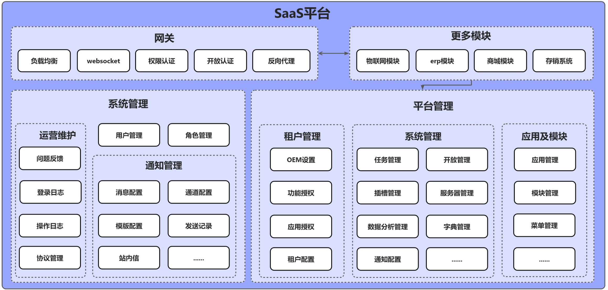
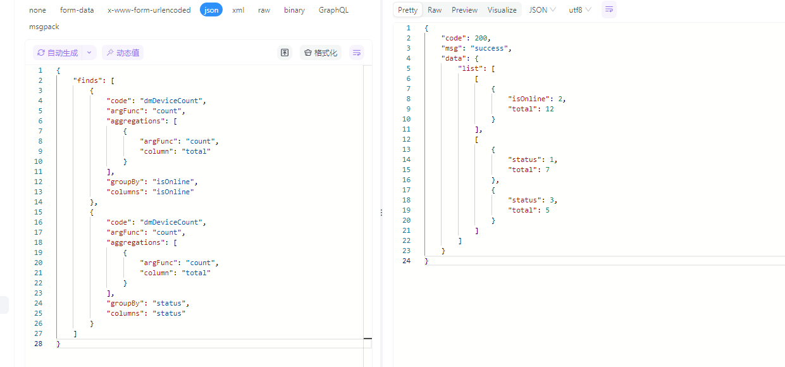
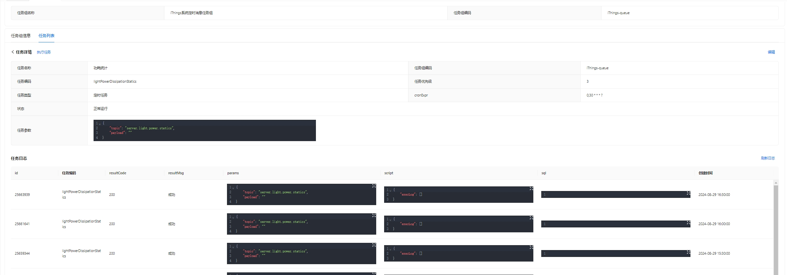

# 联犀 Core - SaaS中台核心模块

## 🚀 产品简介

**联犀 Core** 是联犀物联网平台的SaaS中台核心模块，提供完整的多租户、多项目、多应用管理能力。这是联犀平台最为核心的模块，所有与具体业务无关的基础功能都在这里实现，如租户管理、项目管理、用户管理、角色权限、应用管理等。

用户借助该模块可以直接开发自己的业务系统，不仅限于物联网应用，可以快速构建各种SaaS平台。

> 📖 [完整文档](https://doc.unitedrhino.com/) | 🌐 [在线体验](https://doc.unitedrhino.com/use/ezkveztg/) 

---

## ✨ 核心特性

### 🏢 多租户 & 多项目架构
- 支持多租户及多项目，可以低成本接定制项目
- 完善的租户功能授权、应用授权、模块授权、菜单授权
- 灵活的区域管理，支持树形结构组织

### 🔧 灵活部署模式
- 一套代码同时支持k8s、docker部署
- 支持单体、微服务及集群模式
- 可以通过HTTP、gRPC、NATS及WebSocket快速集成

### ⚡ 高性能设计
- 使用Golang编写，选用高性能组件
- 集成EMQX、NATS、TDengine等高性能组件
- 极致的性能优化保证极端情况的稳定

### 🛠️ 快速开发能力
- 提供Web、小程序、App、设备SDK及模组
- 少量开发即可上线，快速实现业务需求
- 完善的权限管理和数据权限控制

## 🏗️ 系统架构

联犀Core作为SaaS中台的核心模块，为上层业务提供完整的基础服务支撑。

### SaaS中台架构设计

---

## 🔧 核心服务

### syssvr - 系统管理服务

syssvr是SaaS系统的核心模块，是最基础的模块，不依赖其他任何模块。

| 功能模块 | 功能说明 |
|---------|---------|
| **用户管理** | 提供用户登录(微信、钉钉、手机、邮箱等)、登出、会话校验保持等 |
| **租户管理** | 提供租户的管理及OEM、租户功能授权、租户应用授权、租户模块授权、租户菜单授权 |
| **项目管理** | 提供项目的管理及项目配置的管理 |
| **区域管理** | 区域是项目下的树形结构，如：华东项目 → XX街道 → XX房 → XX室 |
| **数据权限** | 提供区域和项目的数据权限管理，支持项目组(家庭组)及房间的授权，细粒度权限控制 |
| **通知管理** | 通知通道、模板及配置管理，支持短信、邮箱、钉钉、微信推送、企业微信站内信及电话通知 |
| **授权管理** | 功能权限管理，通过继承goctl工具生成配置文件，将多个接口集成为一个授权 |
| **角色管理** | 支持多角色、高性能，可以授权项目和区域，也可以授权功能权限、应用模块及菜单权限 |
| **应用管理** | 分为Web应用、App应用、小程序应用，一个Web应用由多个模块组成 |
| **模块管理** | 模块目前用于Web，每个模块都是独立的系统，如物联网、平台管理、系统管理、营销管理等 |
| **字典管理** | 提供加强版字典，不仅支持列表形式，还支持树形结构 |
| **插槽管理** | 在系统需要拓展的地方使用插槽系统进行实时通知、实时校验，增强系统拓展性 |
| **日志管理** | 提供操作日志、登录日志 |
| **运营管理** | 提供工单管理及反馈功能 |

### datasvr - 数据管理服务

在不同的系统中，数据分析是非常重要的部分，而这个部分对前后端来说都是耗时耗力的行为。前端有低代码解决大屏问题，后端也有数据管理服务可以配置后动态获取前端所需数据，方便快捷。

### timed - 定时任务服务

支持定时任务及延时任务，底层使用 [asynq](https://github.com/hibiken/asynq) 实现。

#### 触发方式
- **定时触发**：按时间计划执行任务
- **延时触发**：延迟指定时间后执行
- **消息队列触发**：通过消息队列触发任务

#### 执行方式
- **消息队列发送**：发送消息到指定队列
- **SQL执行**：执行数据库操作
- **脚本执行**：执行自定义脚本

同时可以在管理平台上方便地查看任务执行记录和执行结果，支持立即执行及修改任务信息。

---

## 🛠️ 技术栈

### 后端技术
- **微服务框架**: [go-zero](https://go-zero.dev/) - 高性能微服务框架
- **高性能缓存**: [Redis](https://redis.io/) - 内存数据结构存储
- **消息队列**: [NATS](https://docs.nats.io/) - 高性能消息系统
- **关系型数据库**: [MySQL/MariaDB](https://mariadb.com/) 或 PostgreSQL
- **服务注册中心**: [etcd](https://etcd.io/) (微服务模式)
- **对象存储**: [MinIO](https://min.io/) - 云原生轻量级对象存储

### 前端技术
- **框架**: [Vue.js](https://cn.vuejs.org/) - 渐进式JavaScript框架
- **UI组件**: [Ant Design Vue](https://antdv.com/) - 企业级设计组件

### 移动端
- **小程序**: [uni-app Vue3](https://uniapp.dcloud.net.cn/) - 跨平台开发框架
- **App**: [uni-app X](https://doc.dcloud.net.cn/uni-app-x/) - 支持安卓、iOS、鸿蒙

---

## 🚀 快速开始

### 📋 环境要求
- **Go**: 1.19+
- **数据库**: MySQL 5.7+ 或 PostgreSQL
- **缓存**: Redis 6.0+
- **容器**: Docker (可选，推荐)

### 🛠️ 快速部署

#### 📚 详细部署指南
从环境准备到服务启动，一步步带你完成部署

[📖 查看部署文档](https://doc.unitedrhino.com/use/046431/)

### 💡 遇到问题？

- **📖 查看文档**: [完整文档](https://doc.unitedrhino.com/)
- **🐛 提交 Issue**: [GitHub Issues](https://github.com/unitedrhino/core/issues)
- **💬 加入社区**: 扫码加入微信群，获得技术支持

---

## 💬 联系我们

### 📱 微信交流群

> 💬 **群内已有 500+ 物联网开发者，期待你的加入！**

**扫码加入，开启你的物联网之旅！**

### 📢 公众号

关注公众号，获取更多精彩内容：

### 📞 其他联系方式

- **微信**: godLei6
- **官网**: [https://doc.unitedrhino.com/](https://doc.unitedrhino.com/)
- **GitHub Issues**: [提交问题反馈](https://github.com/unitedrhino/things/issues)

## 🤝 开源社区

- **GitHub**: [联犀 GitHub](https://github.com/unitedrhino/things)
- **Gitee**: [联犀 Gitee](https://gitee.com/unitedrhino/things)
- **官网**: [联犀官网](https://doc.unitedrhino.com/)
---

## 👥 贡献者

感谢所有已经做出贡献的人!

---

## ⭐ 收藏项目

> 💡 **提示**: 如需关注最新版本变化，请移步：[Gitee](https://gitee.com/unitedrhino/core)

---

## 📄 许可证

本项目采用 [Apache License 2.0](LICENSE) 开源许可证。

---

## 🚀 开始你的SaaS中台之旅

如果这个项目对您有帮助，请给我们一个 ⭐ Star

💬 加入我们的社区，与 500+ 开发者一起交流学习

[⭐ Star on GitHub](https://github.com/unitedrhino/core) | [⭐ Star on Gitee](https://gitee.com/unitedrhino/core)

*Made with ❤️ by 联犀团队*
